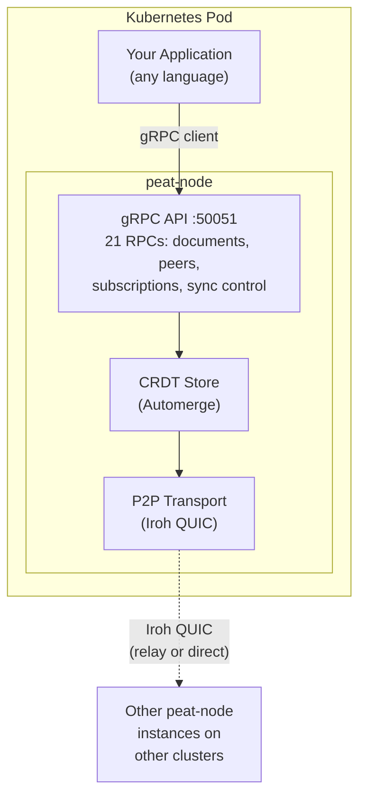
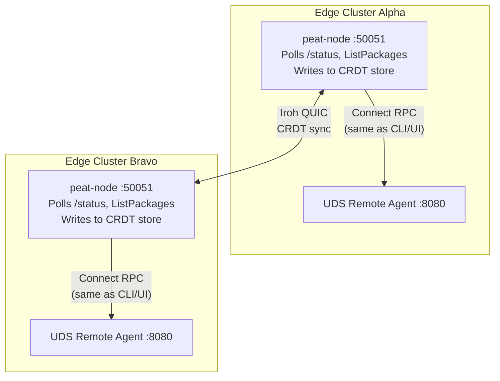

# peat-node

Peat mesh sidecar — a Rust binary that runs alongside applications in Kubernetes pods, participates as a full CRDT mesh node ([Automerge](https://automerge.org/) + [Iroh](https://iroh.computer/) QUIC), and exposes a gRPC API for co-located apps to read/write shared state that syncs across clusters.

**Primary integration target:** [UDS Fleet Management](https://github.com/defenseunicorns/uds-remote-agent) — provides the DDIL-resilient transport layer between edge agents and the Fleet Command Hub.

## How It Works



Documents written on one cluster automatically sync to all connected peers via Automerge CRDT — no central server, works through network partitions, eventually consistent.

## UDS Remote Agent Integration

When deployed alongside [UDS Remote Agent](https://github.com/defenseunicorns/uds-remote-agent), the sidecar's agent watcher polls the agent's existing Connect RPC APIs and syncs fleet state across clusters:



Query either sidecar to see fleet-wide agent state from both clusters.

**Zero modifications to UDS Remote Agent required.** The watcher uses the same Connect RPC protocol (`connect.WithGRPC()` over HTTP/2) as the `uds-agent-cli` and web UI.

### What Syncs

| Data | CRDT Collection | Source API |
|------|----------------|------------|
| Agent health, K8s version, architecture | `platforms/{agent-id}` | `GET /status` |
| Deployed packages (name, version, status) | `deployments/{agent-id}:{pkg}` | `ListPackages` |
| Pulled/cached packages | `packages/{agent-id}:{ref}` | `ListPulledPackages` |

### What Doesn't Sync

- Agent settings (registry credentials) — security boundary
- Active pod status — cluster-local, from K8s informers
- In-flight deployment progress — transient

### Tested Scenarios

| Test | Result |
|------|--------|
| Single sidecar smoke test (put/get/delete/subscribe) | Pass |
| Two-node bidirectional CRDT sync | Pass (sub-second sync) |
| Real UDS Remote Agent + watcher + mesh sync (local processes) | Pass |
| Two k3d clusters, each with UDS Remote Agent + peat-node sidecar | Pass |
| In-cluster Helm deployment watching agent via cluster DNS | Pass |

## Quick Start

```bash
# Build
cargo build --release

# Run standalone
./target/release/peat-node \
  --listen tcp://0.0.0.0:50051 \
  --data-dir /tmp/peat-node \
  --node-id my-node \
  --auto-sync

# Run with agent watcher (watches local UDS Remote Agent)
./target/release/peat-node \
  --listen tcp://0.0.0.0:50051 \
  --agent-addr http://localhost:8080 \
  --agent-poll-interval 10 \
  --auto-sync
```

## gRPC API

The sidecar exposes `peat.sidecar.v1.PeatSidecar` with 21 RPCs:

| Category | RPCs |
|----------|------|
| **Lifecycle** | `GetStatus` |
| **Peers** | `ConnectPeer`, `DisconnectPeer`, `ListPeers` |
| **Documents** | `PutDocument`, `GetDocument`, `DeleteDocument`, `ListDocuments` |
| **Typed Collections** | `PutPlatform`, `GetPlatforms`, `PutCell`, `GetCells`, `PutTrack`, `GetTracks`, `PutCommand`, `GetCommands` |
| **Subscriptions** | `Subscribe` (server-streaming) |
| **Sync Control** | `StartSync`, `StopSync`, `GetSyncStats` |

Proto definition: [`proto/sidecar.proto`](proto/sidecar.proto)

## Deployment

### Docker

```bash
docker build -t peat-node:latest .
docker run -p 50051:50051 peat-node:latest --listen tcp://0.0.0.0:50051
```

### Helm (Standalone)

```bash
helm install peat-node chart/peat-node/ \
  --namespace peat-system --create-namespace \
  --set listen=tcp://0.0.0.0:50051
```

### Helm (Sidecar with UDS Remote Agent)

```bash
# Deploy peat-node watching the agent via cluster DNS
helm install peat-node chart/peat-node/ \
  --namespace peat-system --create-namespace \
  --set listen=tcp://0.0.0.0:50051 \
  --set agentAddr=http://uds-remote-agent-svc.zarf.svc.cluster.local:8080 \
  --set agentPollInterval=10
```

### Helm (Injectable Sidecar Template)

The chart provides injectable templates for adding peat-node as a container in any pod:

```yaml
# In a parent chart's deployment.yaml:
containers:
  - name: my-app
    ...
  {{- include "peat-node.container" .Subcharts.peat-node | nindent 8 }}
volumes:
  {{- include "peat-node.volumes" .Subcharts.peat-node | nindent 8 }}
```

### Zarf Package

```bash
# Build the Zarf package
zarf package create .

# Deploy to a UDS cluster
zarf package deploy zarf-package-peat-node-*.tar.zst --confirm
```

### UDS Bundle

The UDS bundle enables the UDS Package CR (NetworkPolicies for Iroh QUIC mesh traffic):

```bash
cd bundle && uds create . && uds deploy uds-bundle-peat-node-*.tar.zst --confirm
```

## Configuration

All flags can be set via environment variables with `PEAT_NODE_` prefix:

| Flag | Env Var | Default | Description |
|------|---------|---------|-------------|
| `--listen` | `PEAT_NODE_LISTEN` | `tcp://0.0.0.0:50051` | gRPC listen address |
| `--data-dir` | `PEAT_NODE_DATA_DIR` | `/data/peat-node` | Persistent data directory |
| `--node-id` | `PEAT_NODE_NODE_ID` | Random UUID | Node identifier |
| `--app-id` | `PEAT_NODE_APP_ID` | `peat-default` | Formation/group ID |
| `--shared-key` | `PEAT_NODE_SHARED_KEY` | | Base64 shared key |
| `--peer` | `PEAT_NODE_PEERS` | | Peer endpoint IDs (comma-separated) |
| `--auto-sync` | `PEAT_NODE_AUTO_SYNC` | `true` | Start sync on boot |
| `--agent-addr` | `PEAT_NODE_AGENT_ADDR` | | Service to watch (e.g. `http://localhost:8080`) |
| `--agent-poll-interval` | `PEAT_NODE_AGENT_POLL_INTERVAL` | `10` | Poll interval (seconds) |

## Design

See [docs/DESIGN.md](docs/DESIGN.md) for:
- Relationship to UDS Fleet Management architecture
- How Peat provides the DDIL-resilient transport layer
- Agent watcher design (maps heartbeat data to CRDT collections)
- Connected vs DDIL operation modes
- Fleet state propagation options (A through D)
- Air-gap / tablet mesh bridge scenario

## Project Structure

| Path | Description |
|------|-------------|
| `proto/sidecar.proto` | gRPC service definition |
| `src/main.rs` | CLI + server bootstrap |
| `src/node.rs` | SidecarNode (Automerge + Iroh mesh stack) |
| `src/service.rs` | gRPC service implementation |
| `src/watcher.rs` | Agent watcher (Connect RPC poller) |
| `chart/peat-node/` | Helm chart (deployment, service, UDS Package CR, injectable sidecar templates) |
| `bundle/uds-bundle.yaml` | UDS bundle |
| `zarf.yaml` | Zarf package config |
| `Dockerfile` | Multi-stage build (debian:bookworm-slim) |
| `docs/DESIGN.md` | Architecture and integration design |
| `test/go/` | Go client library + integration tests (smoketest, synctest, watchertest, query, cluster e2e) |

## Related Projects

| Project | Description |
|---------|-------------|
| [peat](https://github.com/defenseunicorns/peat) | Decentralized mesh protocol (Rust) |
| [test/go/](test/go/) | Go client library + integration tests (in this repo) |
| [uds-remote-agent](https://github.com/defenseunicorns/uds-remote-agent) | UDS Remote Agent (primary integration target) |
| [peat-registry](https://github.com/defenseunicorns/peat-registry) | OCI registry sync (validates the sidecar pattern) |

## GitHub Issues

| Issue | Description |
|-------|-------------|
| [peat#747](https://github.com/defenseunicorns/peat/issues/747) | peat-node umbrella |
| [peat#748](https://github.com/defenseunicorns/peat/issues/748) | Agent watcher |
| [peat#750](https://github.com/defenseunicorns/peat/issues/750) | Cluster-to-cluster test |
| [peat#751](https://github.com/defenseunicorns/peat/issues/751) | Fleet state propagation design |
| [uds-remote-agent#533](https://github.com/defenseunicorns/uds-remote-agent/issues/533) | FleetService (future agent-side APIs) |

## License

[Apache License 2.0](LICENSE)
